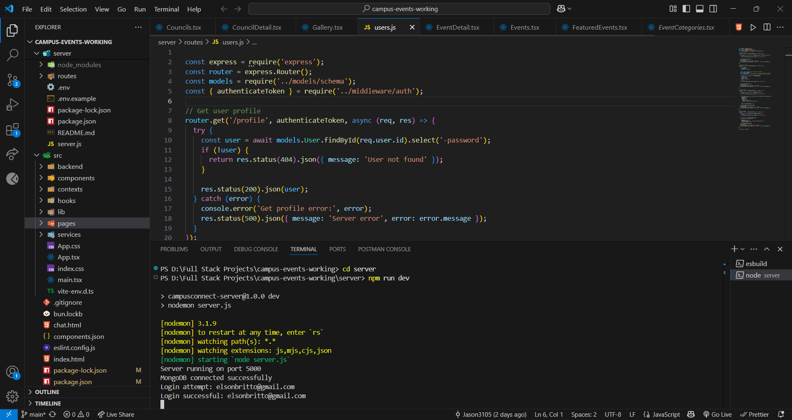
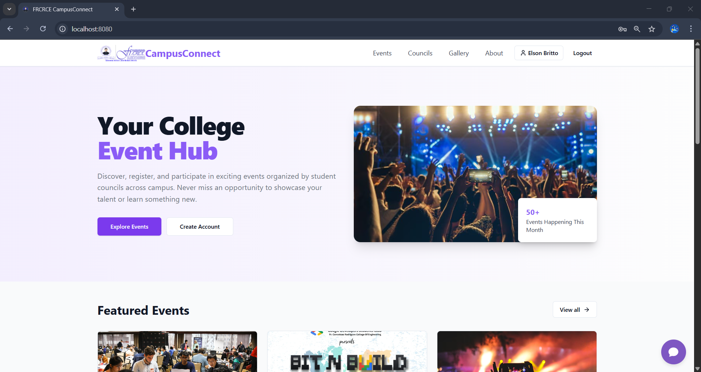
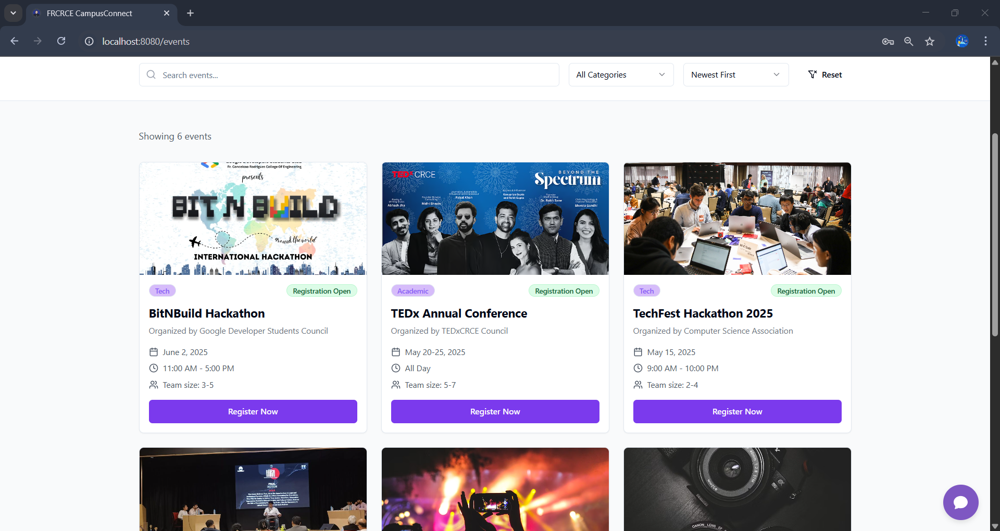
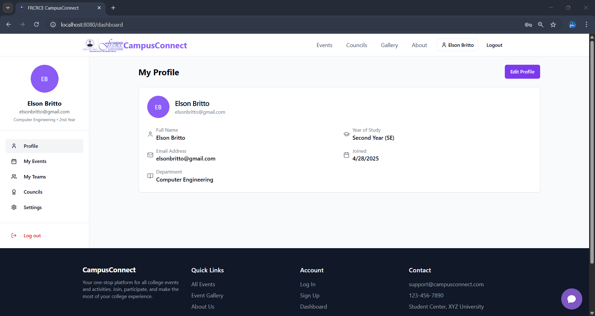
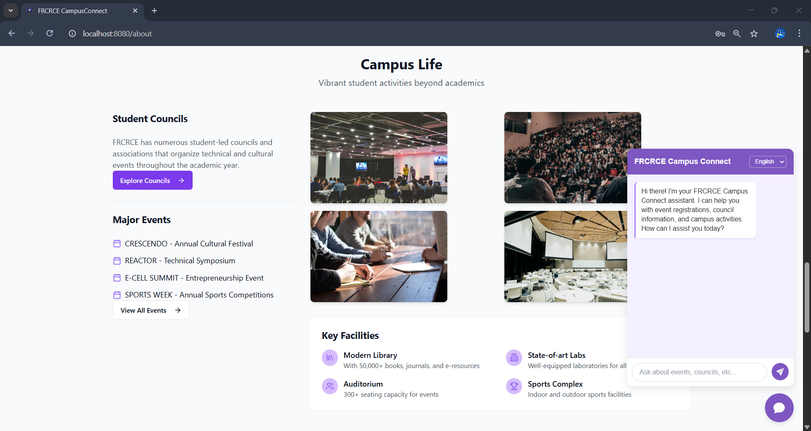
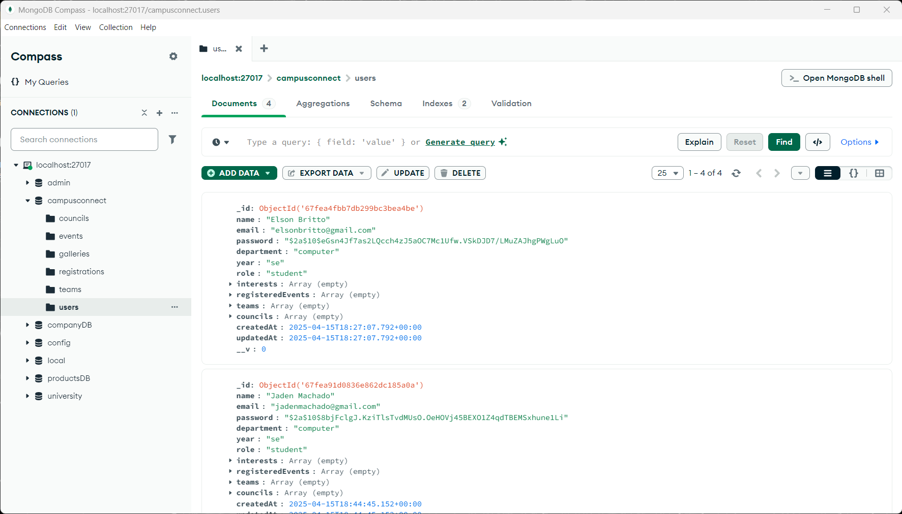
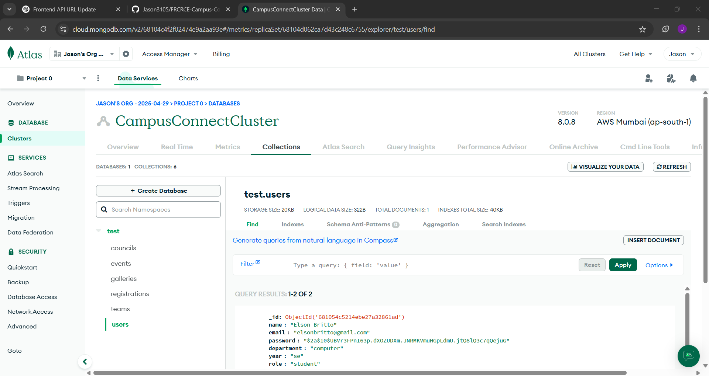

# CampusConnect 🎓

CampusConnect is a comprehensive platform designed to connect students with campus events, student councils, and activities. It provides a centralized hub for discovering, registering, and participating in exciting events organized by various student councils across campus.  

## 🚀 Live Demo  
[Click here to try CampusConnect](https://frcrcecampusconnect.onrender.com/)  

## 📹 YouTube Demo
[](https://www.youtube.com/watch?v=VIDEO_ID)

## ✨ Features

### 🎪 Event Management
- Browse and discover campus events by category
- Register for events with a simple click
- View event details including date, time, location, and organizers
- Filter events by type (Tech, Business, Cultural)
- Track event registration status (Open/Closed)

### 👥 Student Councils
- Connect with various student councils and organizations
- View council details and membership information
- Apply to join councils through the platform

### 👤 User Profiles
- Personalized user profiles with academic information
- Track your registered events and council memberships
- Manage your personal information and preferences

### 📱 Responsive Design
- Seamless experience across desktop and mobile devices
- User-friendly interface for easy navigation

## 🛠️ Technologies Used

<p align="left">
   React.js 
   Vite 
   HTML5 
   CSS3 
   JavaScript 
   Node.js 
   Express.js 
   MongoDB / MongoDB Atlas 
</p>


## 🏁 Getting Started

### Prerequisites
- Node.js (v14.0 or later)
- npm (v6.0 or later)
- MongoDB

### Installation Steps  

1. Clone the repository:  
   git clone https://github.com/username/campus-connect.git  
   cd campus-connect  
2. Install dependencies:  
   Install server dependencies  
   cd server  
   npm install  
   Install client dependencies  
   npm install  
3. Set up environment variables:  
   - Create a `.env` file in the server directory  
   - Add the following variables:  
     ```  
     PORT=8080  
     MONGODB_URI=your_mongodb_connection_string  
     JWT_SECRET=your_jwt_secret  
     ```  
4. Run the application:
   Start the server  
   cd server  
   npm run dev  
   In a separate terminal, start the client  
   cd FRCRCE-Campus-Connect  
   npm run dev  
5. Open your browser and navigate to `http://localhost:8080`  

## 📁 Project Structure  

<pre>
FRCRCE-Campus-Connect/
├── Images/                 # Project images
├── node_modules/            # Installed npm packages
├── public/                  # Static public files
├── server/                  # Backend code
│   ├── config/              # Backend configs (e.g., DB)
│   ├── models/              # Database models
│   ├── routes/              # API route files
│   └── controllers/         # Request handlers
├── src/                     # Frontend (React app)
│   ├── components/          # Reusable UI parts
│   ├── pages/               # Full pages
│   ├── hooks/               # Custom hooks
│   ├── context/             # Global states
│   ├── App.tsx              # Main app setup
│   └── main.tsx             # Entry point
├── .gitignore               # Files Git should ignore
├── bun.lockb                # Bun package lock file
├── chat.html                # Standalone HTML page
├── components.json          # Components metadata
├── eslint.config.js         # Linting rules
├── index.html               # Base HTML template
├── package-lock.json        # Dependency versions
├── package.json             # Project config
├── postcss.config.js        # PostCSS setup
├── README.md                # Project guide
├── tailwind.config.ts       # Tailwind settings
├── tsconfig.app.json        # TS config for frontend
├── tsconfig.json            # Main TS config
├── tsconfig.node.json       # TS config for backend
└── vite.config.ts           # Vite build settings

</pre>

## 📸 Screenshots


  
  
  
  
  
  
   
